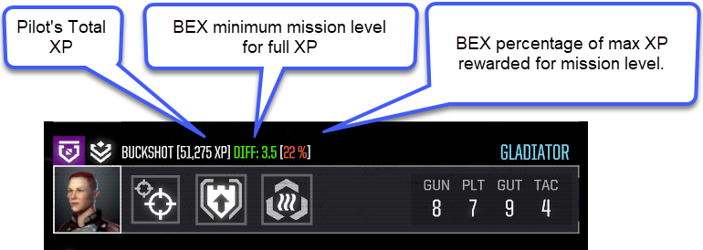
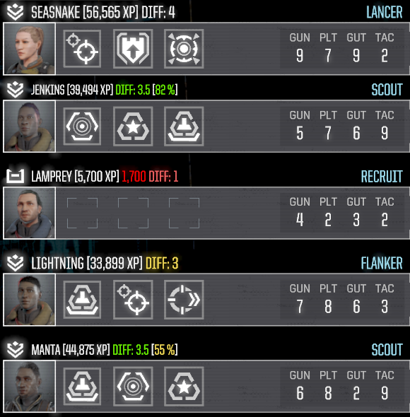

# BtShowXp

Optionally displays the Pilot's Total XP, XP Corruption, minimum mission difficulty to earn full XP with BEX CE's XP cap, and/or BEX's Level cap percentage of XP award.

When configurating a lance for a contract, the Difficulty text will be Green if the pilot will get full XP from the current contract.  If the pilot is exactly at the XP cap level of the mission, the percentage of the max XP for the mission will be displayed.

Other features:
* Contains a temporary fix for BEX which restores the "percentage of XP awarded" logic.
* Can reset pilot's spent XP when the Spent XP is "corrupted" and does not match the skills purchased.

The rest of the document contains various customization and install options, which most users will not need.






# Upgrading
For users upgrading from versions prior to 1.1, it is recommended to overwrite the mod.json in the BTShowXp install directory.


## Difficulty Note
The actual difficulty of a mission can go up or down from the displayed difficulty.  The mod may show a green difficulty highlight even though the final difficulty will be under the minimum difficulty and only get 10% XP (default XP Cap setting).


# Difficulty Colors

The difficulty (Diff: N.N) is colored based on how close to the contract difficulty the pilot is.

The purpose is to allow the user to quickly identify the pilots that can obtain the highest possible XP for the mission.

To return to the single White/Green color scheme from previous versions, change the DifficultyColors setting in mod.json to only contain a single entry.  
Previous versions of this mod used green (#4CFF00).

Default Colors:


# mod.json Settings

Setting | Description
|---|---|
|```ShowPilotXp = true``` | Shows the pilot's XP on the pilot placard.
|```ShowPilotXpCorruption = true``` | Displays red XP text on the pilot placard if the pilot's Total XP does not match the skills and unspent XP.  The number is the computed difference between expected and actual XP.
|```ShowPilotXpMinDifficulty = true``` | If Battletech Extended CE is installed and XP Caps is enabled, the minimum mission difficulty to get full XP will be shown.
|```ShowPilotXpMinDifficultyWorkAround = false``` | If ```ShowPilotXpMinDifficulty``` is enabled, adds .5 difficulty to the computed difficulty to work around BEX's XP Cap level bug.  Will be removed when the BEX issue is resolved.  If ```UseBexXpCapFix``` is enabled, set this to false.  For more info on the original bug, see [XP Cap Workaround](#bex-xp-cap-workaround) below.
|```UseBexXpCapFix = true```| If true, will fix the BEX  XP Cap Bug with a temporary patch.  If Extended_CE.dll's XP cap logic has been changed, then the Cap fix will not be enabled.
|```XpPercentageDisplay = "BasedOnPatchStatus"```| Controls when the XP Cap XP award percentage is displayed.  See the [XpPercentageDisplay](#xppercentagedisplay) section below.
|```DebugOutput = false```|If true, will output additional logging.
|```XpCapPercentageColors```| The colors for the "percentage of XP" section of the display.  Delta25 to Delta100 is each 25% step for the percentage.
|```DifficultyColors```| A list of colors for the difficulty delta.  See [Difficulty Colors](#difficulty-colors)


## XpPercentageDisplay
For most users, the default value will not need to be changed.

|Setting|Description|
|--|--|
|Always|Always show, regardless of other settings.|
|Off|Never show|
|BasedOnPatchStatus|Will be shown if the BEX visual workaround is disabled and the BEX XP Cap bug fix is enabled.|

When BEX fixes the XP cap bug in the BEX source code, use Always instead.

Default Colors:


# Resetting Corrupt XP

Before resetting the XP, try saving and reloading the game.  This will sometimes correct the XP.

## Dislaimers
It is recommend to make a backup of the game saves before using.  This has been tested locally and appears to work correctly, but there could be unexpected consequences.

The Battletech campaign save directory for a Steam install is at Steam\userdata\3847327\637090\remote\C0\SGS1 . 

I am unsure at this point why the Spent XP vs Unspent XP gets out of sync over time with various mods so user beware that there may be some reason for the mismatch that I am unaware of.  

## Usage
If a pilot has corrupt XP (as shown by red text), the pilot can be reset by going to the barracks by clicking the pilot's portrait while holding down control (ctrl+click).

Make sure there pilot is not currently selected or the click will not work.  This is a known issue.
Currently each pilot must be changed individually.

## Steam Backups
The Battletech career backups on a Steam install should be under Steam\userdata\3847327\637090\remote\C#\SGS#

Where # is a number.


# Installation
To install, download the BtShowXp.zip from the releases section and extract to the Battletech Mods folder.

This assumes ModTek has been installed and injected.


# Compatibility
This should be compatible with all mods.
Safe to add to and remove from existing saves.


# BEX XP Cap Workaround

**Update**:  The default settings of this mod includes a temporary fix for BEX's XP Cap bug.  This section describes the bug, but is effectively mitigated.

Currently BEX contains a bug where a pilot will never recieve a percentage of XP when at the end of a XP level.

Effectively this requires .5 more difficulty to obtain XP beyond the XP Cap minimum.
However, when the pilot requires 5 star missions, this bug will effectively limit the pilot to the XP Cap minimum XP (10% by default).

The bug has been accepted by the BEX team.
